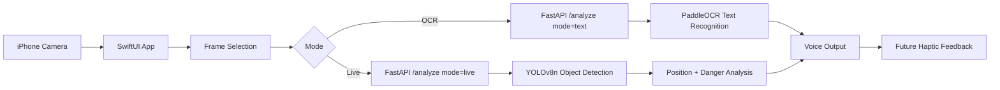
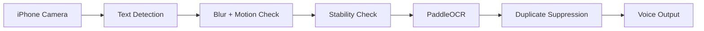
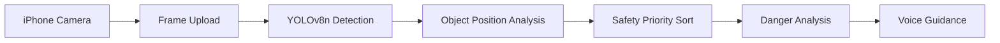

# Accessibility Assistant Demo Summary

## Slide 1: Problem Definition

**Slide content**

- Visually impaired users need fast, low-friction help with reading text and understanding nearby obstacles.
- Existing tools often separate text reading from scene guidance.
- Our goal is a camera-based assistant that gives immediate voice guidance from an iPhone camera feed.

**Speaker notes**

This project focuses on two common daily situations: reading nearby text and moving through a sidewalk or indoor path with obstacles. The prototype uses the iPhone camera as the input device and turns visual information into spoken feedback.

---

## Slide 2: Project Goal

**Slide content**

- Build a working iPhone accessibility assistant prototype.
- Provide two modes:
  - **OCR Text Reading Mode**: read visible text aloud.
  - **Live Guidance Mode**: detect nearby objects and guide the user by position.
- Use a FastAPI backend with PaddleOCR and YOLOv8n.

**Speaker notes**

The important point is that this is not only a concept. The app has a camera UI, mode switching, backend communication, OCR processing, YOLO training outputs, and detection screenshots.

---

## Slide 3: System Architecture

**Slide content**

**Speaker notes**

The iOS app captures camera frames and sends them to the FastAPI backend using a multipart request. The same `/analyze` endpoint supports both modes. Text mode returns recognized text and a voice guide. Live mode returns detected objects and a guidance message based on object type and position.

---

## Slide 4: OCR Text Reading Mode

**Concise explanation**

OCR Text Reading Mode helps the user read signs, labels, documents, menus, or nearby text. The app first checks whether text is visible and stable, then sends a clean frame to the backend for PaddleOCR recognition. The recognized text is displayed in the app and spoken aloud.

**Execution flow**

**Speaker notes**

The Swift frontend uses live text-frame analysis before running full OCR. This prevents unnecessary backend calls when the camera is moving or the text is not stable. The OCR flow also suppresses repeated speech so the same text is not read over and over.

---

## Slide 5: OCR UX States

**Slide content**

- Searching for text
- Text detected
- Stabilizing
- Reading text
- Listening for new text
- Camera unavailable

**Recommended screenshot**

- Capture current iPhone app in **OCR Mode** with visible recognized text.

**Caption**

OCR Mode shows a large, high-contrast status panel and recognized text area designed for accessibility-first feedback.

**Speaker notes**

This screen demonstrates the user experience work: large readable text, strong contrast, simple mode switching, voice-first guidance, and haptic-state hooks for future feedback.

---

## Slide 6: Live Guidance Mode

**Concise explanation**

Live Guidance Mode monitors the forward camera view and detects objects that may affect walking safety. The backend runs YOLOv8n detection, classifies object position as left, center, or right, prioritizes safety-critical objects, and returns a short voice instruction.

**Execution flow**

**Speaker notes**

The system prioritizes vehicles first, then pedestrians and mobility-related objects, then obstacles. It also uses position analysis so the voice message can say whether the risk is on the left, center, or right.

---

## Slide 7: Live Guidance UX

**Slide content**

- Camera-first interface
- Large guidance message
- Direction strip: left, center, right
- Voice output for immediate feedback
- Haptic feedback manager already implemented for future tactile alerts

**Recommended screenshot**

- Capture current iPhone app in **Live Guidance** mode.

**Caption**

Live Guidance Mode presents a simple forward-scene monitoring interface with voice-first alerts and directional guidance.

**Speaker notes**

This slide should show that the prototype is designed around the user. The interface does not require visual precision from the user; the primary output is speech, with haptic feedback prepared as an extension.

---

## Slide 8: YOLO Training & Detection

**Slide content**

- Model: YOLOv8n
- Dataset format: YOLO sidewalk dataset
- Classes: person, vehicle types, bicycle, scooter, wheelchair, stroller, traffic objects, poles, bollards, benches, signs, plants, and more
- Training output includes `best.pt`, `last.pt`, labels visualization, train batches, and prediction screenshots
- Current recorded final metrics from `results.csv`:
  - Precision: `0.6923`
  - Recall: `0.4100`
  - mAP50: `0.4644`
  - mAP50-95: `0.2743`

**Recommended screenshots**

- `runs/detect/runs/sidewalk/yolov8n_sidewalk/labels.jpg`
- `runs/detect/runs/sidewalk/yolov8n_sidewalk/train_batch0.jpg`
- `runs/detect/predict/Bbox_0221_MP_SEL_037129.jpg`
- `runs/detect/predict/Bbox_0240_MP_SEL_042078.jpg`

**Captions**

- `labels.jpg`: Dataset label distribution used to inspect class coverage before training.
- `train_batch0.jpg`: Augmented training samples showing the model’s sidewalk object training input.
- `Bbox_0221_MP_SEL_037129.jpg`: YOLO prediction output with detected sidewalk objects drawn as bounding boxes.
- `Bbox_0240_MP_SEL_042078.jpg`: Detection example demonstrating real-world object localization.

**Speaker notes**

This slide proves that model training has been executed and that detection outputs exist. The metrics are useful as an honest prototype benchmark: the current model works, and the next step is improving recall and robustness through more data, tuning, and validation.

---

## Slide 9: Demo Screenshots

**Recommended layout**

Use a 2x2 grid:

1. OCR Mode app screenshot
2. Live Guidance app screenshot
3. YOLO detection output screenshot
4. Training batch or label visualization

**Recommended screenshots and captions**

- **OCR app screen**: Shows text reading mode, status transitions, recognized text, and voice output behavior.
- **Live Guidance app screen**: Shows camera-based guidance, mode switching, and directional feedback UI.
- `runs/detect/predict/Bbox_0170_MP_SEL_031192.jpg`: Shows object detection on a sidewalk scene.
- `runs/detect/runs/sidewalk/yolov8n_sidewalk/train_batch1.jpg`: Shows training data examples and bounding-box labels.

**Speaker notes**

Keep this slide visual. The goal is to show progress in one glance: mobile app, OCR function, live detection, and model training.

---

## Slide 10: Demo Storyline

**Problem**

Visually impaired users need quick assistance reading text and understanding obstacles without changing devices or workflows.

**Solution**

An iPhone camera assistant with two simple modes: OCR for reading and Live Guidance for object-aware navigation support.

**Implementation**

SwiftUI camera app sends frames to a FastAPI backend. PaddleOCR handles text recognition. YOLOv8n handles object detection. The app returns high-contrast visual feedback and spoken guidance.

**Demo**

1. Open the app in Live Guidance Mode.
2. Show the camera preview and mode selector.
3. Point the camera at a sidewalk or detection example.
4. Switch to OCR Mode.
5. Point at readable text.
6. Show the recognized text and voice output.
7. Show YOLO training and prediction screenshots as implementation evidence.

**Future improvements**

Improve detection recall, add stronger distance estimation, support continuous approach tracking in the backend, tune speech frequency, and expand haptic feedback for low-noise navigation.

**Speaker notes**

The demo should feel like a real product test: start from user need, show the app, show the backend and AI outputs, then explain what still needs to improve.

---

## Slide 11: Future Improvements

**Slide content**

- Improve YOLO model performance with more balanced data and validation.
- Add per-session object tracking for approach warnings.
- Add distance estimation or depth support.
- Expand haptic feedback for text detection, danger alerts, and direction cues.
- Add offline or on-device inference exploration for lower latency.
- Improve multilingual OCR and noisy-scene text handling.

**Speaker notes**

The current prototype already demonstrates the full pipeline. The next step is making it more reliable, faster, and safer in real walking environments.

---

## Slide 12: Conclusion

**Slide content**

- Working iPhone camera prototype
- Two accessibility-focused modes
- FastAPI backend integration
- PaddleOCR text reading
- YOLOv8n training and detection results
- Voice-first UX with future haptic support

**Speaker notes**

The project shows actual implementation progress across mobile UI, backend APIs, OCR, custom object detection training, and accessibility-focused interaction design.

---

## One-Slide Mode Summary

| Mode | Purpose | Main AI Component | Output |
| --- | --- | --- | --- |
| OCR Text Reading Mode | Read visible text aloud | PaddleOCR | Recognized text + voice reading |
| Live Guidance Mode | Detect obstacles and guide user | YOLOv8n | Object position + safety voice guidance |

## Screenshot Checklist

| Asset | Status | Use |
| --- | --- | --- |
| `runs/detect/predict/Bbox_0221_MP_SEL_037129.jpg` | Existing | YOLO detection example |
| `runs/detect/predict/Bbox_0240_MP_SEL_042078.jpg` | Existing | YOLO detection example |
| `runs/detect/predict/Bbox_0170_MP_SEL_031192.jpg` | Existing | Live object localization example |
| `runs/detect/runs/sidewalk/yolov8n_sidewalk/labels.jpg` | Existing | Dataset/class distribution |
| `runs/detect/runs/sidewalk/yolov8n_sidewalk/train_batch0.jpg` | Existing | Training examples |
| OCR Mode iPhone screenshot | Capture needed | OCR app UX and result |
| Live Guidance iPhone screenshot | Capture needed | Live guidance app UX |

